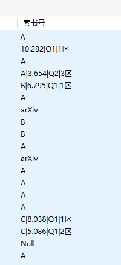

由于没有找到excel版的中科院分区2022的数据，没法更新中科院分区2022，望有该数据的童鞋提供，以助尽快更新

# 更新
1. 更新到jcr2022，sci2022
2. 微小调整

# Zotero-Scholar-Rank

在索书号字段显示CCF分区，影响因子，JCR分区，中科院分区，如图。索书号字段需要手动调出显示。

显示规则：

1.对于会议显示CCF分区

2.对于期刊如果有的话显示CCF分区，影响因子，JCR分区，中科院分区。期刊需要有期刊名字段。

